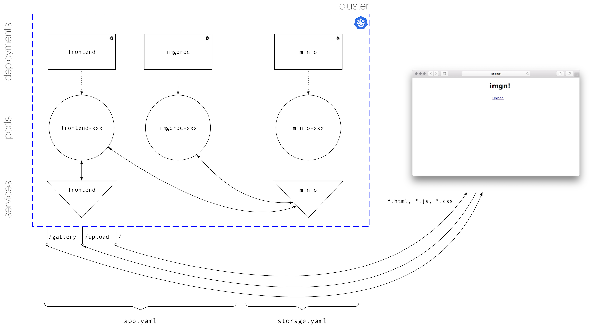
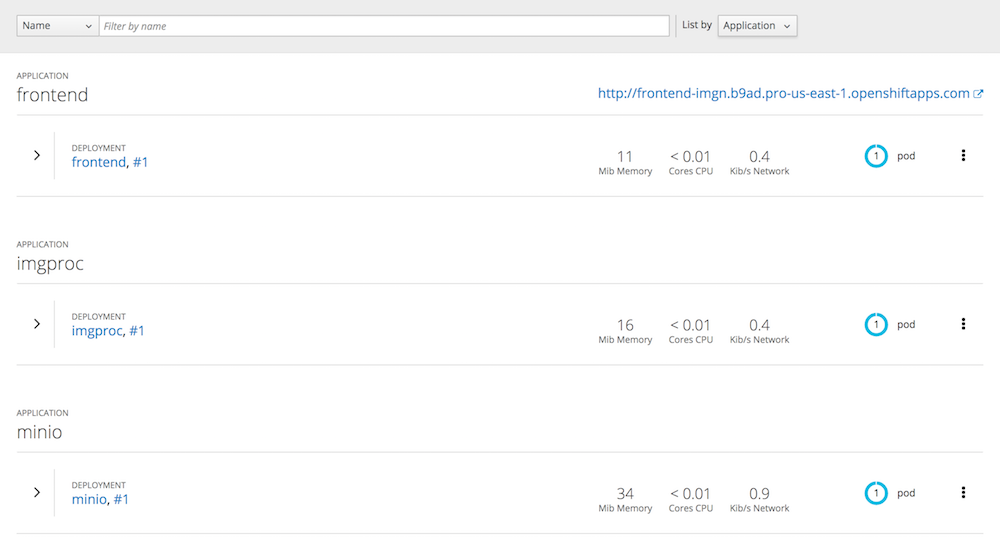
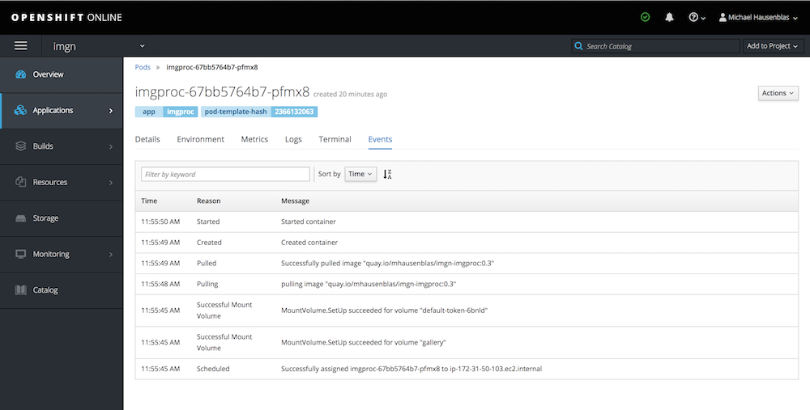
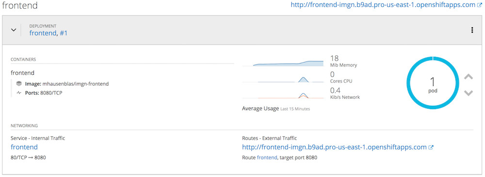

# imgn containerized

The overall architecture of `imgn` as a containerized microservices app looks as follows:




## Preparation

Make sure you have Kubernetes in version 1.8 or above available (check with `kubectl version --short`). You can, for example, use the [Katacoda playground](https://katacoda.com/courses/kubernetes/playground) for this. I'll be using [OpenShift Online](https://manage.openshift.com/) in the following.

First, create a namespace for the `imgn`. This is the place all `imgn` components will be deployed to:

```bash
$ kubectl create ns imgn
```

Since I'm using OpenShift, rather than creating a namespace using above command, I'm creating a project (think of it as a namespace on steroids) via the `oc new-project imgn` command.

Next, clone this repository here using the following command; this makes all manifest files we're using for the deployment available:

```bash
$ git clone https://github.com/mhausenblas/imgn.git
$ cd imgn/containers
```

## Deploy

To deploy the entire `imgn` app, simply do the following:

```bash
$ kubectl -n=imgn apply -f storage.yaml
$ kubectl -n=imgn apply -f app.yaml
```

Wait for a few minutes, giving Kubernetes time to pull the container images and when you see something like the following (all pods should have the status `Running`) you know everything is fine:

```bash
$ kubectl -n=imgn get pod,svc,deploy
NAME                        READY     STATUS    RESTARTS   AGE
frontend-6b7b596bd4-2qkns   1/1       Running   0          5m
imgproc-bcb7dcc5f-7xwkc     1/1       Running   0          5m
minio-74b998f6bc-cfncm      1/1       Running   0          5m

NAME         TYPE        CLUSTER-IP       EXTERNAL-IP   PORT(S)    AGE
frontend     ClusterIP   10.100.190.215   <none>        80/TCP     5m
kubernetes   ClusterIP   10.96.0.1        <none>        443/TCP    12m
minio        ClusterIP   10.107.25.237    <none>        9000/TCP   5m

NAME       DESIRED   CURRENT   UP-TO-DATE   AVAILABLE   AGE
frontend   1         1         1            1           5m
imgproc    1         1         1            1           5m
minio      1         1         1            1           5m
```

## Use

Now that `imgn` is deployed, in order to use it, it depends on the environment what options you have to make the frontend available to clients outside of the cluster.

All cloud providers provide load balancers you can use, you could set up your own [Ingress](https://kubernetes.io/docs/concepts/services-networking/ingress/) controller and expose the service via an Ingress resource, or, if you're using OpenShift as I do here, you can simply benefit from the built-in Routes feature, allowing you to make the frontend available like so:

```bash
$ oc expose svc frontend
$ oc describe route frontend
Name:                   frontend
Namespace:              imgn
Created:                26 seconds ago
Labels:                 app=frontend
Annotations:            openshift.io/host.generated=true
Requested Host:         frontend-imgn.b9ad.pro-us-east-1.openshiftapps.com
                          exposed on router router (host elb.b9ad.pro-us-east-1.openshiftapps.com) 26 seconds ago
Path:                   <none>
TLS Termination:        <none>
Insecure Policy:        <none>
Endpoint Port:          8080

Service:        frontend
Weight:         100 (100%)
Endpoints:      10.130.35.26:8080
```

From above output we learn that the `imgn` app is available (in my case) via http://frontend-imgn.b9ad.pro-us-east-1.openshiftapps.com.

## Notes

* In this containerized setup we're using [Minio](https://www.minio.io/) as the storage layer, so that different microservices can share the image data and metadata.
* You can scale the microservices as you like, they are stateless.

Following some internals, that is, screen shots from the OpenShift Web console, showing the app as a whole, events and resource consumption:







