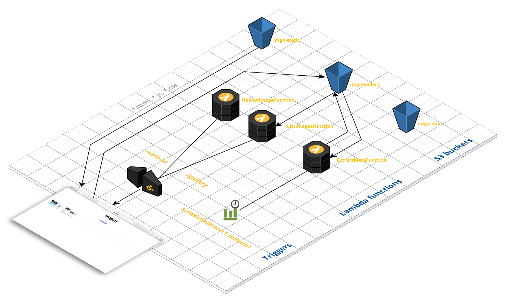

# imgn serverless

The overall architecture of `imgn` serverless looks as follows:



In order to build the app, clone this repo and work in the `functions/` subdirectory. Also, make sure you've got the `aws` CLI and the [SAM CLI](https://github.com/awslabs/aws-sam-cli) installed.

## Preparation

Create S3 buckets, one for the UI (`imgn-static`), one for the Lambda functions (`imgn-app`), and one for storing the uploaded images (`imgn-gallery`):

```bash
# setting up the UI bucket:
$ aws s3api create-bucket \
      --bucket imgn-static \
      --create-bucket-configuration LocationConstraint=eu-west-1 \
      --region eu-west-1
$ aws s3api put-bucket-policy \
      --bucket imgn-static \
      --policy file://s3-ui-bucket-policy.json \
      --region eu-west-1
$ aws s3 website s3://imgn-static/ \
      --index-document index.html

# setting up the app bucket holding the Lambda functions:
$ aws s3api create-bucket \
      --bucket imgn-gallery \
      --create-bucket-configuration LocationConstraint=eu-west-1 \
      --region eu-west-1
$ aws s3api put-bucket-policy \
      --bucket imgn-gallery \
      --policy file://s3-gallery-bucket-policy.json \
      --region eu-west-1
$ aws s3 website s3://imgn-gallery/ \
      --index-document index.html

# setting up the content bucket for the images to be uploaded:
$ aws s3api create-bucket \
      --bucket imgn-app \
      --create-bucket-configuration LocationConstraint=eu-west-1 \
      --region eu-west-1
```

## Lambda functions and HTTP API

How to build and deploy the Lambda functions and a HTTP API with [SAM](https://github.com/awslabs/serverless-application-model). If you're interested in how to set up and deploy a function and the API Gateway manually, using the `aws` CLI, check out the [notes](low-level/) here.

### Local development

To get started I did `sam init --name app --runtime go1.x` initially and developed each of the functions independently. In order for the local simulation to work, you need to have Docker running. Note: Local testing the API is at time of writing not possible since [CORS is locally not supported](https://github.com/awslabs/aws-sam-cli/issues/323), yet.

For each code iteration, in `app/` do:

```bash
# 1. run emulation of Lambda and API Gateway locally (via Docker):
$ sam local start-api

# 2. update Go source code (add functionality, fix bugs)

# 3. create new binaries which are also automagically synced into the local SAM runtime:
$ make build
```

If you change anything in the SAM/CF [template file](app/template.yaml) then you need to re-start the local API emulation.

### Development and deployment in live environment

The following assumes that the S3 buckets as outlined above are set up and you have access to AWS.

For each code iteration, in `app/` do:

```bash
# package all artefacts:
$ sam package \
      --template-file template.yaml --output-template-file imgn-stack.yaml \
      --s3-bucket imgn-app
# deploy CF stack:
$ sam deploy \
      --template-file imgn-stack.yaml \
      --stack-name imgnstack \
      --capabilities CAPABILITY_IAM
```

Note: above two steps are also available via `make deploy`.

```bash
# get the HTTP API endpoint:
$ aws cloudformation describe-stacks \
      --stack-name imgnstack | \
      jq '.Stacks[].Outputs[] | select(.OutputKey=="ImgnAPIEndpoint").OutputValue' -r

# invoke upload image function via HTTP API endpoint from previous step:
curl -XPOST \
     --form "file=@some.jpg" 
     https://XXXXXXXXXX.execute-api.eu-west-1.amazonaws.com/Prod/upload/
```

### Clean up

```bash
$ aws cloudformation delete-stack \
      --stack-name imgnstack
```

## UI

Once the CF stack is deployed and the HTTP endpoints are known, we can deploy the UI like so:

```bash
./deploy-ui.sh
```

Now the UI is available via http://imgn-static.s3-website-eu-west-1.amazonaws.com/.

Note that above will query the CF stack, replace the respective HTTP endpoints for the
`/upload` and `/gallery` JS calls, and sync the result to the `imgn-static` S3 bucket.