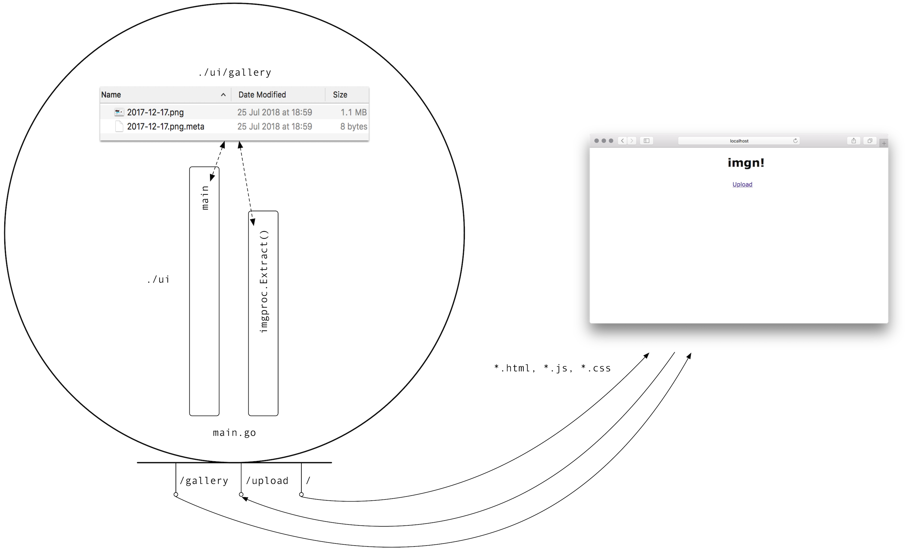
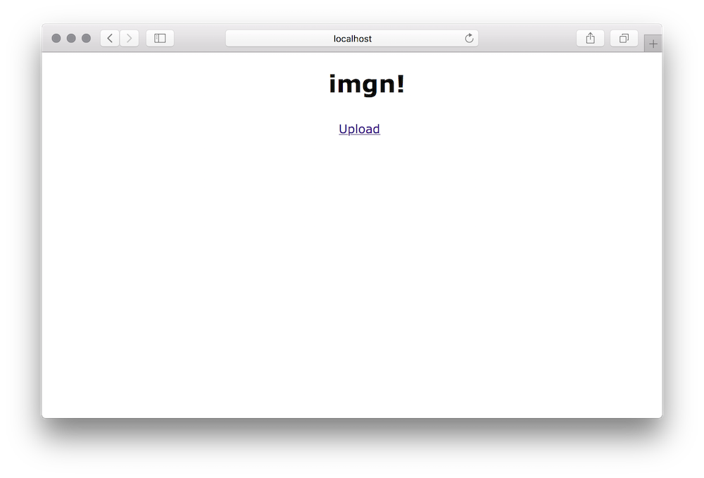
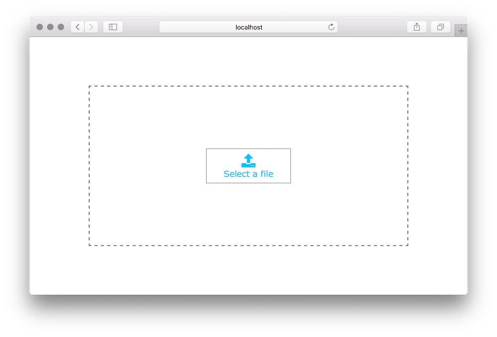
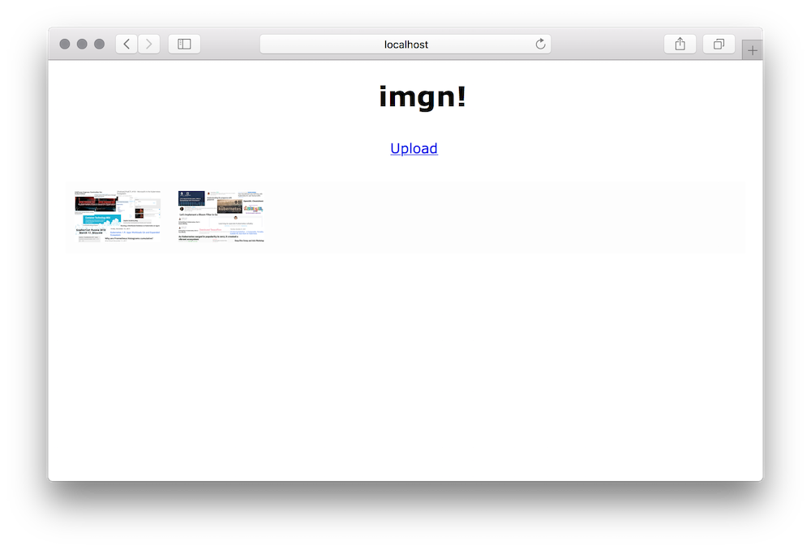
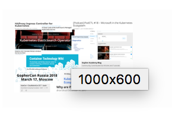

# imgn as a monolith

The overall architecture of `imgn` as a monolith looks as follows:



To run `imgn` as a monolith, in the simplest case, do the following (in the `monolith` directory, assuming you have Go 1.10 or above installed):

```bash
$ go run main.go
2018/07/25 18:36:10 imgn server running
2018/07/25 18:38:50 Added metadata for: ui/gallery/2017-12-17.png
2018/07/25 18:38:50 Added metadata for: ui/gallery/2017-12-25.jpg
```

Now, head over to http://localhost:8080/ and you should see the start screen (empty gallery, no images uploaded yet:



Once you upload images by clicking on the `Upload` link, you'll see the following: 



Here you can upload PNG or JPEG files and once the upload is completed, the app will automatically return to gallery, which now should look something like this:



If you now hover over one of the images, you'll see the extracted metadata (the dimension):



Both the images and the metadata are stored in a subdirectory of the app, check it out like so:

```bash
$ ls -al monolith/ui/gallery
total 2240
drwxr-xr-x   5 mhausenblas  staff      160 25 Jul 18:59 .
drwxr-xr-x  11 mhausenblas  staff      352  2 Jul 14:08 ..
-rw-r--r--   1 mhausenblas  staff  1132403 25 Jul 18:59 2017-12-17.png
-rw-r--r--   1 mhausenblas  staff        8 25 Jul 18:59 2017-12-17.png.meta

$ cat monolith/ui/gallery/2017-12-17.png.meta
1000x600
```